WORK IN PROGRESS

> **📚 [View Complete Documentation Index](./DOCUMENTATION_INDEX.md)** - Central navigation for all developer documentation

# Table of Contents

- [Disclaimer](#disclaimer)
- [Abstract](#abstract)
- [Developer Resources](#developer-resources)
- [NPM Lib Change History](#npm-lib-change-history)
- [Key Features](#key-features)
- [Common Input Properties](#common-input-properties)
- [Default Components](#default-components)
  - [Badge](#badge)
  - [Button](#button)
  - [Switch](#switch)
  - [Switch Button](#switch-button)
  - [Card](#card)
    - [Card Section Basic](#card--card-section-basic)
  - [Entry Container](#entry-container)
  - [Entry Metric](#entry-metric)
  - [Entry Key Value](#entry-key-value)
  - [Entry Tile Item](#entry-tile-item)
  - [Entry Tile](#entry-tile)
  - [Metric Tile](#metric-tile)
  - [Tabs](#tabs)
  - [Tab](#tab)
  - [Toolbar](#toolbar)
  - [Value Tile](#value-tile)
  - [List](#list)
    - [List Item](#list--list-item)
    - [List Item KPI](#list--list-item-kpi)
    - [List Footer](#list--list-footer)
- [Content and Navigation Components](#content-and-navigation-components)
  - [Grid](#grid)
  - [Menu Bar](#menu-bar)
  - [Menu Item (config only)](#menu-item-config-only)
  - [Side Menu](#side-menu)
    - [Side Menu Section](#side-menu--side-menu-section)
    - [Side Menu Entry](#side-menu--side-menu-entry)
    - [Side Menu Sub Entry](#side-menu--side-menu-sub-entry)
  - [Window](#window)
  - [Content](#content)
- [Component Usage](#component-usage)

# Disclaimer

This is a private fun project which has no productive focus. It is not actively maintained and there is no support. It is free of use at own risk.

# Abstract

Welcome to the documentation of this project, a comprehensive and modular library designed to streamline the development of user interfaces in Angular applications. This documentation serves as a guide to help you leverage the power and flexibility of our UI components effectively in your projects.

It offers a rich collection of reUseable components that are carefully crafted to enhance the user experience while promoting consistency and scalability across applications. Whether you are building a simple web application or a complex enterprise-grade solution, our library provides the building blocks you need to create modern and visually appealing interfaces with ease.

# Developer Resources

For developers contributing to or using this library:

## Quick Start

- **[Developer Guide](./DEVELOPER_GUIDE.md)** - Complete developer overview with quick links
- **[Quick Start Guide](./QUICK_START.md)** - Get started creating components in minutes
- **[Component Creation Script](../../create-component.sh)** - Automated component scaffolding

## Detailed Documentation

- **[Component Structure Guide](./COMPONENT_STRUCTURE.md)** - Comprehensive guide on component architecture, naming conventions, and best practices
- **[Contributing Guide](./CONTRIBUTING.md)** - How to contribute to the project
- **[Component Templates](./.templates/)** - Ready-to-use template files for quick component creation

## Creating a New Component

The fastest way to create a new component:

```bash
# From project root
./create-component.sh my-component
```

This automatically:
- Creates all necessary files with proper structure
- Renames files to match your component name
- Updates file contents with correct naming
- Adds export to public-api.ts

For more details, see the [Quick Start Guide](./QUICK_START.md).

# NPM Lib Change History

- **0.2.13**
  - added `ui-switch-button` component

- **0.2.12** 
  - Enhanced layout components `content` and `window` to better support menu headers
  - added `ui-button-group` component
  - improved button support in key-value component
  - styling improvements on several components


### Key Features:

**Modular Architecture**: Our library follows a modular architecture, allowing you to pick and choose the components you need for your specific project requirements. Each component is self-contained and can be easily integrated into your Angular application, promoting code reusability and maintainability.

# Common Input Properties

These properties are supported in each component and so only described once in this section.  
In this documentation there is a property '_Useable standalone_' for each component. Some components are only designed to be nested inside another one. Those would have a 'No' here!

### `isLoading`

> boolean

Indicates whether the content is still loading. If set to `true` the component will show a loading indicator.  
Default is `false`. When use building blocks consider using `isLoading` on most granular components.  

### `tooltip`

> string

Tooltip is an optional text that can be shown on mouse over for applicable components.  
In each component it is defined if this supports tooltips or not.

### `data`

> any

This property can be optionally set to any value for further / future use.

### `id`

> string

The Id can uniquely indentify the current item. All output events will emit this id (for example onClick events).  

### `errorMessage`

> string

If set the component will fallback in its error state and will show an overlay with the provided `errorMessage`.  
Any content or loading states will be overriden / hidden.  
Please make sure that this is understandable and short.


# Default Components

Short description about the purpose and content of the component.  

## Badge
> Useable standalone: **Yes**  
> Supports loading indicator: **No**  
> Supports tooltip: **Yes**  
> Supports error message: **No**  
> Selector: `ui-badge`

### Inputs
#### `value`
> Type: *number*  
> Optional: **Yes** (in case `label` is used, this can be omitted)  

Represents the number that is shown in the badge circle.   Maximum is 99. Everything bigger is shown as 99+.  

#### `label`
> Type: *string*   
> Optional: **Yes** (in case `value` is used, this can be omitted)  

Displays text on the left to the badge `value`. Can also be used without setting a `value`.  

### Accepts as Sub-Component
NONE

#### Useable inside
- Button
- Accordion Panel Header
- Entry Tile Item
- Value Tile

### Usage
`<ui-badge value="4" [style]="3"></ui-badge>`

### Screenshot
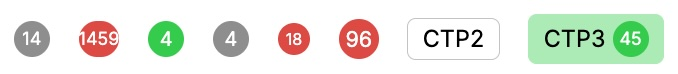

---

## Button
> Useable standalone: **Yes**  
> Supports loading indicator: **Yes**  
> Supports error message: **No**  
> Supports tooltip: **Yes**  
> Selector: `ui-button`

### Inputs

#### `label`
> Type: *string*  
> Optional: **Yes**  
The text label displayed on the button.

#### `style`
> Type: *ButtonStyle*  
> Optional: **Yes** (default: `Primary`)  
Defines the visual style of the button.  
Possible values:  
- `Simple_primary = 0`: Small petrol button, no border/background  
- `Simple_destructive = 6`: Small red button, no border/background  
- `Primary = 1`: Petrol background, white text (**default**)  
- `Secondary = 2`: Grey background, white text  
- `Outline = 3`: White fill, petrol border  
- `Destructive = 4`: Red background, white text  
- `Confirm = 5`: Green background, white text  

#### `icon`
> Type: *IconDefinition*  
> Optional: **Yes**  
Font Awesome icon to display in the button.

#### `isDisabled`
> Type: *boolean*  
> Optional: **Yes** (default: `false`)  
Disables the button if set to `true`.

#### `onClick`
> Type: *EventEmitter&lt;MouseEvent&gt;*  
> Emits when the button is clicked.

#### `simpleOnly`
> Type: *boolean*  
> Internal use only  
Forces simple-only styles (overrides others).

#### `iconOnlySimpleStyle`
> Type: *boolean*  
> Internal use only  
Forces icon-only simple style (overrides others).

#### `whiteMode`
> Type: *boolean*  
> Optional: **Yes** (default: `false`)  
Use for simple styles on dark backgrounds.

### Accepts as Sub-Component
- [Badge](#badge)

#### Useable inside
- Entry Tile
- Entry Item
- Card
- Card Section Basic
- Toolbar
- Value Tile

### Usage
`<ui-button label="Apply" [icon]="faCheck()" [style]="1">`

### Screenshot
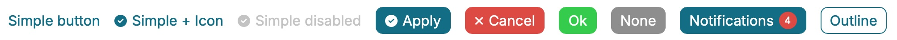

---

## Switch
> Useable standalone: **Yes**  
> Supports loading indicator: **No**  
> Supports error message: **No**  
> Supports tooltip: **Yes**  
> Selector: `ui-switch`

### Inputs

#### `label`
> Type: *string*  
> Optional: **Yes**  
The text label displayed next to the switch.

#### `state`
> Type: *boolean*  
> Optional: **Yes** (default: `false`)  
> Two-way binding supported  
The current state of the switch (on/off).

#### `isDisabled`
> Type: *boolean*  
> Optional: **Yes** (default: `false`)  
Disables the switch if set to `true`.

### Accepts as Sub-Component
NONE

#### Useable inside
- Accordion Panel Header
- Entry Tile Item

### Usage
`<ui-switch label="Enable feature" [(state)]="featureEnabled">`

### Screenshot
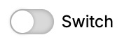
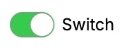

--- 

## Switch Button
> Useable standalone: **Yes**  
> Supports loading indicator: **No**  
> Supports error message: **No**  
> Supports tooltip: **Yes**  
> Selector: `ui-switch-button`

### Description
A multi-option toggle button component that allows users to switch between multiple choices. Each option is declared as a `ui-switch-button-option` sub-component with its own `label`, `value`, and optional `icon` inputs. The component uses parent injection for selection coordination — the same pattern as `ui-side-menu`.

### Inputs

#### `selectedValue`
> Type: *string | number | boolean*  
> Optional: **Yes**  
> Two-way binding supported  
The currently selected value.

#### `isDisabled`
> Type: *boolean*  
> Optional: **Yes** (default: `false`)  
> Two-way binding supported  
Disables the switch button if set to `true`.

### Accepts as Sub-Component
- `ui-switch-button-option`

#### Useable inside
- Card
- Toolbar
- Entry Tile
- Entry Tile Item

---

## Switch Button Option
> Useable standalone: **No** (requires `ui-switch-button` parent)  
> Selector: `ui-switch-button-option`

### Description
Individual option entry inside a `ui-switch-button`. Injects the parent component to coordinate selection state automatically.

### Inputs

#### `label`
> Type: *string*  
> Required: **Yes**  
Display text for the option.

#### `value`
> Type: *string | number | boolean*  
> Required: **Yes**  
Value associated with this option.

#### `icon`
> Type: *IconDefinition*  
> Optional: **Yes**  
Font Awesome icon displayed beside the label.

#### `isDisabled`
> Type: *boolean*  
> Optional: **Yes** (default: `false`)  
Disables this individual option.

### Outputs

#### `onSelectionChange`
> Type: *OutputEmitterRef&lt;string | number | boolean&gt;*  
Emits the option's value when it is clicked and selected.

### Usage
```html
<ui-switch-button [(selectedValue)]="viewMode">
  <ui-switch-button-option label="List" value="list" [icon]="faList()">
  </ui-switch-button-option>
  <ui-switch-button-option label="Grid" value="grid" [icon]="faGrip()">
  </ui-switch-button-option>
</ui-switch-button>
```

### Screenshot
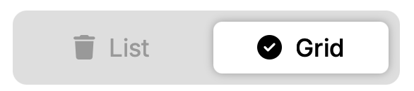

--- 

## Card
> Useable standalone: **Yes**  
> Supports loading indicator: **Yes**  
> Supports error message: **Yes**  
> Supports tooltip: **Yes** (on header)  
> Selector: `ui-card`

### Inputs

#### `header`
> Type: *string*  
> Required: **Yes**  
Main header title of the card, shown at the top.

#### `headerRight`
> Type: *string*  
> Optional: **Yes**  
Header content shown in the right slot of the header.

#### `style`
> Type: *CardStyle*  
> Optional: **Yes** (default: `None`)  
Defines the visual style of the card header and border.  
Possible values:  
- `None` = grey (default)  
- `Attention` = orange  
- `Error` = red  
- `Success` = green  
- `Highlight` = petrol  

#### `toggleSelect`
> Type: *boolean*  
> Optional: **Yes** (default: `false`)  
If `true` and `isClickable` is `true`, the selection of the component is retained until the next click (toggles).

#### `isSelected`
> Type: *boolean*  
> Optional: **Yes** (default: `false`)  
Selection state of the component. If `isClickable` and `toggleSelect` are `true`, the selection is retained until the next click.

#### `isClickable`
> Type: *boolean*  
> Optional: **Yes** (default: `false`)  
If `true`, the card is clickable and emits the `onClick` event.

#### `onClick`
> Type: *EventEmitter&lt;string | null&gt;*  
> Emits the `id` of the component when clicked.

### Accepts as Sub-Component
- [Button](#button) (in header only)
- [Switch](#switch) (in header only)
- [Card Section Basic](#card-section-basic)

### Screenshot
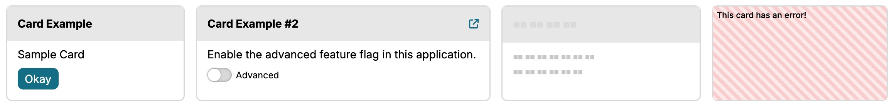

## Card :: Card Section Basic
> Useable standalone: **No**  
> Supports loading indicator: **Yes**  
> Supports error message: **Yes**  
> Supports tooltip: **No**  
> Selector: `ui-card-section-basic`

### Inputs

#### `header`
> Type: *string*  
> Optional: **Yes**  
Header/title for this section, shown on top before `text`.

#### `text`
> Type: *string*  
> Optional: **Yes**  
Text shown as section content. Uses `innerHTML` so HTML formatting can be applied.

#### `list`
> Type: *Array&lt;string&gt;*  
> Optional: **Yes**  
Simple unformatted list shown below the `text`.

#### `style`
> Type: *CardStyle*  
> Optional: **Yes** (default: `None`)  
Defines the style and icon of the section.  
Possible values:  
- `None` = no icon (default)  
- `Attention` = orange  
- `Error` = red  
- `Success` = green  
- `Information` = grey  

#### `styledMessage`
> Type: *string*  
> Optional: **Yes**  
Message shown in the style color. Ignored if `style` is `None`.

#### `showStyledBackground`
> Type: *boolean*  
> Optional: **Yes** (default: `false`)  
Shows a colored background if the style is not `None`.

#### `toggleSelect`
> Type: *boolean*  
> Optional: **Yes** (default: `false`)  
If `true` and `isClickable` is `true`, the selection of the component is retained until the next click (toggles).

#### `isSelected`
> Type: *boolean*  
> Optional: **Yes** (default: `false`)  
Selection state of the component. If `isClickable` and `toggleSelect` are `true`, the selection is retained until the next click.

#### `isClickable`
> Type: *boolean*  
> Optional: **Yes** (default: `false`)  
If `true`, the section is clickable and emits the `onClick` event.

#### `onClick`
> Type: *EventEmitter&lt;string | null&gt;*  
> Emits the `id` of the component when clicked.

### Accepts as Sub-Component
- [Button](#button)
- [Switch](#switch)
- [Entry Key Value](#entry-key-value)

### Usage Example

```html
<ui-card header="Orders" [style]="1">
  <ui-card-section-basic 
    header="Partner A" 
    [style]="3">
  </ui-card-section-basic>
  <ui-card-section-basic 
    text="There is some text" 
    styledMessage="The confirmation is pending since 2 days."
    header="Partner A"
    [showStyledBackground]="true"
    [style]="1">
  </ui-card-section-basic>
</ui-card>
```
---

## Entry Container
> Useable standalone: **Yes**  
> Supports loading indicator: **No**  
> Supports error message: **No**  
> Supports tooltip: **No**  
> Selector: `ui-entry-container`

This component is just a wrapper around the _Entry Key Value_ component and _Entry Metric_ component. They will be layouted and there is some event handling on top. Both of them are designed to be used inside this _Entry Container_ but they can also be used inside others and the _Entry Key Value_ component also standalone.

### Inputs

#### `isClickable`
> Type: *boolean*  
> Optional: **Yes** (default: `false`)  
If `true`, the entry container is clickable and emits the `onClick` event.

#### `toggleSelect`
> Type: *boolean*  
> Optional: **Yes** (default: `false`)  
If `true` and `isClickable` is `true`, the selection of the component is retained until the next click (toggles).

#### `isSelected`
> Type: *boolean*  
> Optional: **Yes** (default: `false`)  
Selection state of the component. If `isClickable` and `toggleSelect` are `true`, the selection is retained until the next click.

#### `onClick`
> Type: *EventEmitter&lt;string | null&gt;*  
> Emits the `id` of the component when clicked.

### Accepts as Sub-Component
- [Entry Key Value](#entry-key-value) (max 2)
- [Entry Metric](#entry-metric) (max 1)

#### Useable inside
- [Metric Tile](#metric-tile)

### Usage
`<ui-entry-container [isClickable]="true" (onClick)="handleClick($event)">
  <ui-entry-key-value label="State" value="Completed"></ui-entry-key-value>
  <ui-entry-metric [percent]="33"></ui-entry-metric>
</ui-entry-container>`


### Screenshot
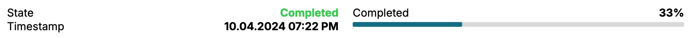

--- 

## Entry Metric
> Useable standalone: **No**  
> Supports loading indicator: **Yes**  
> Supports error message: **Yes**  
> Supports tooltip: **Yes**  
> Selector: `ui-entry-metric`

This is just a very simple bar to show percentage values (0-100) as a colored bar. If uses just scss, no other library needed.

### Inputs

#### `percent`
> Type: *number*  
> Optional: **No** (default: `0`)  
Value to show, from 0 to 100. Values above 100 are capped at 100.

#### `style`
> Type: *EntryMetricStyle*  
> Optional: **Yes** (default: `None`)  
Defines the color style of the metric bar.  
Possible values:  
- `None` = default  
- `Attention` = orange  
- `Error` = red  
- `Success` = green  

### Accepts as Sub-Component
NONE

#### Useable inside
- [Entry Container](#entry-container)
- [Card Section Basic](#card--card-section-basic)

### Usage
`<ui-entry-metric [percent]="70" [style]="2"></ui-entry-metric>`

### Screenshot
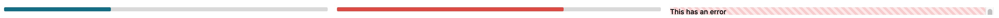

---

## Entry Key Value 
> Useable standalone: **Yes**  
> Supports error message: **Yes**  
> Supports loading indicator: **Yes**  
> Supports tooltip: **Yes** (right side)  
> Selector: `ui-entry-key-value`  

The standard component to show simple key/value pairs in this library. It can be used everywhere and as well it is designed to be used inside several other components inside this lib.

### Inputs

#### `label`
> Type: *string*  
> Required: **Yes**  
Label for the key/value pair, shown on the left.

#### `value`
> Type: *string*  
> Required: **Yes**  
Value for the key/value pair, shown on the right.

#### `style`
> Type: *EntryKeyValueStyle*  
> Optional: **Yes** (default: `None`)  
Defines the color style of the item.  
Possible values:  
- `None` = black (default)  
- `Attention` = orange  
- `Error` = red  
- `Success` = green  
- `Dimmed` = grey  

#### `isBig`
> Type: *boolean*  
> Optional: **Yes** (default: `false`)  
If `true`, increases the font size of the key and value (and icon, if present).

#### `showIcon`
> Type: *boolean*  
> Optional: **Yes** (default: `false`)  
If `true`, displays a style-based icon next to the value.

### Accepts as Sub-Component
NONE

#### Useable inside
- [Entry Container](#entry-container)
- [Entry Tile](#entry-tile)
- [Card Section Basic](#card--card-section-basic)

### Usage
`<ui-entry-key-value label="Status" value="Completed" [style]="3" [isBig]="true" [showIcon]="true"></ui-entry-key-value>`

### Screenshot
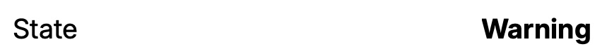

---

## Entry Tile
> Useable standalone: **Yes**  
> Supports error message: **No**  
> Supports loading indicator: **Yes**  
> Supports tooltip: **No**  
> Selector: `ui-entry-tile`  

A container component for grouping multiple entry tile items and/or key-value pairs, often used for displaying lists or paginated data.

### Inputs

#### `isCollapsed`
> Type: *boolean*  
> Optional: **Yes** (default: `false`)  
Controls whether the tile is collapsed (hides content).

#### `currentPage`
> Type: *number*  
> Optional: **Yes** (default: `0`)  
Current page index for paginated content.

#### `paginationTooltip`
> Type: *string*  
> Optional: **Yes** (default: `'Page '`)  
Tooltip text for pagination controls.

### Accepts as Sub-Component
- [Entry Tile Item](#entry-tile-item) (max 5)
- [Entry Key Value](#entry-key-value) (max 2)
- [Button](#button) (max 2)

#### Useable inside
NONE

### Usage

```html
<ui-entry-tile>
  <ui-entry-key-value label="Order" value="12345"></ui-entry-key-value>
  <ui-entry-tile-item header="Details" [style]="2">
    <ui-badge value="2"></ui-badge>
    <ui-button label="Edit"></ui-button>
    <ui-switch label="Active"></ui-switch>
  </ui-entry-tile-item>
  <ui-entry-tile-item header="Shipping" [style]="1">
    <ui-badge value="1"></ui-badge>
  </ui-entry-tile-item>
</ui-entry-tile>
```

### Screenshot
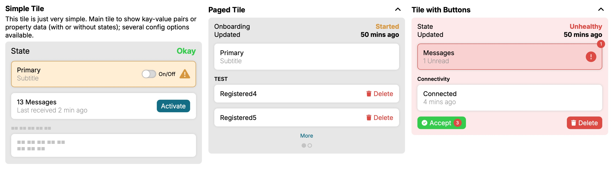

## Entry Tile:: Entry Tile Item
> Useable standalone: **No**  
> Supports error message: **Yes**  
> Supports loading indicator: **Yes**  
> Supports tooltip: **Yes**  
> Selector: `ui-entry-tile-item`  

Represents a single item within an entry tile, supporting badges, buttons, and switches as sub-components.

### Inputs

#### `header`
> Type: *string*  
> Optional: **Yes**  
Group header to be shown at the top of the item.

#### `style`
> Type: *EntryItemStyle*  
> Optional: **Yes** (default: `None`)  
Defines the color style of the item.  
Possible values:  
- `None` = grey (default)  
- `Attention` = orange  
- `Error` = red  
- `Success` = green  

### Accepts as Sub-Component
- [Badge](#badge)
- [Button](#button)
- [Switch](#switch)

#### Useable inside
- Entry Tile

---

## Metric Tile
> Useable standalone: **Yes**  
> Supports error message: **No**  
> Supports loading indicator: **No**  
> Supports tooltip: **No**  
> Selector: `ui-metric-tile`  

A container component for displaying multiple metric entries, each represented by an [Entry Container](#entry-container) with a single key-value and a single metric. Useful for dashboards and summary views.

### Inputs

#### `header`
> Type: *string*  
> Required: **Yes**  
Header of the metric tile, shown at the top.

#### `description`
> Type: *string*  
> Optional: **Yes**  
Description text shown below the header and above the tile content.

### Accepts as Sub-Component
- [Entry Container](#entry-container) (max 5, each with max 1 key-value and 1 metric)

#### Useable inside
NONE

### Usage

```html
<ui-metric-tile header="Test Metrics" description="Overview of current metrics">
  <ui-entry-container>
    <ui-entry-key-value label="None" value="14%" [style]="1"></ui-entry-key-value>
    <ui-entry-metric [percent]="14" [style]="1"></ui-entry-metric>
  </ui-entry-container>
  <ui-entry-container>
    <ui-entry-key-value label="Started" value="33%"></ui-entry-key-value>
    <ui-entry-metric [percent]="33"></ui-entry-metric>
  </ui-entry-container>
  <ui-entry-container>
    <ui-entry-key-value label="Completed" value="53%" [style]="3"></ui-entry-key-value>
    <ui-entry-metric [percent]="53" [style]="3"></ui-entry-metric>
  </ui-entry-container>
</ui-metric-tile>
```

### Screenshot
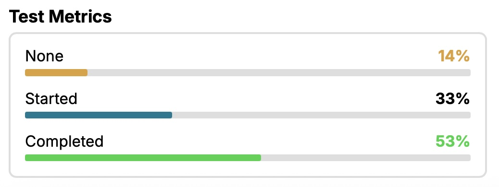

---

## Tabs
> Useable standalone: **Yes**  
> Supports error message: **No**   
> Supports loading indicator: **No**  
> Supports tooltip: **No**  
> Selector: `ui-tabs`  

A container component for organizing content into multiple tabbed panels. Handles tab switching, active state, and navigation controls.

### Inputs

#### `activeIndex`
> Type: *number*  
> Optional: **Yes** (default: `-1`)  
Controls the active tab by index (0-based). Overrides the `isActive` property of child tabs.

#### `showPrevNextButtons`
> Type: *boolean*  
> Optional: **Yes** (default: `true`)  
If `true`, shows previous/next tab navigation buttons.

### Accepts as Sub-Component
- [Tab](#tab)

#### Useable inside
- Any container

### Usage

```html
<ui-tabs [(activeIndex)]="activeTabIndex" [showPrevNextButtons]="true">
  <ui-tab label="Fruits" badgeValue="2" badgeStyle="3">
    <li>Apple</li>
    <li>Lemon</li>
  </ui-tab>
  <ui-tab label="Pizza" [isActive]="true">
    <li>Salami</li>
    <li>Funghi</li>
  </ui-tab>
  <ui-tab label="Disabled" [isDisabled]="true">
    <li>Unreachable</li>
    <li>Content</li>
  </ui-tab>
  <ui-tab label="More Fruits">
    <li>Kiwi</li>
    <li>Banana</li>
  </ui-tab>
</ui-tabs>
```

### Screenshot
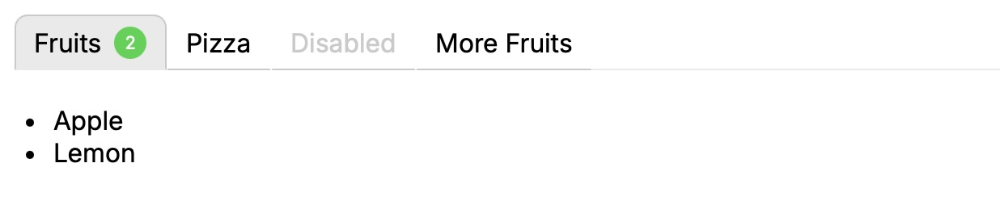

## Tabs:: Tab
> Useable standalone: **No**  
> Supports error message: **No**     
> Supports loading indicator: **No**  
> Supports tooltip: **Yes**  
> Selector: `ui-tab`  

Represents a single tab within a `ui-tabs` container. Can display a label, badge, and any content.

### Inputs

#### `label`
> Type: *string*  
> Optional: **Yes**  
Label for this tab, shown in the tab header.

#### `isActive`
> Type: *boolean*  
> Optional: **Yes**  
Controls whether this tab is currently active. Managed by the parent `ui-tabs` if `activeIndex` is used.

#### `isDisabled`
> Type: *boolean*  
> Optional: **Yes** (default: `false`)  
If `true`, the tab is disabled and cannot be selected.

#### `badgeValue`
> Type: *number*  
> Optional: **Yes**  
Shows a badge with the given value next to the tab label.

#### `badgeStyle`
> Type: *BadgeStyle*  
> Optional: **Yes** (default: `None`)  
Defines the style of the badge if `badgeValue` is set.

### Accepts as Sub-Component
Everything (any content can be placed inside a tab)

#### Useable inside
- [Tabs](#tabs)

### Usage
see [Tabs](#tabs) Component

---

## Toolbar
> Useable standalone: **Yes**  
> Supports error message: **No**    
> Supports loading indicator: **No**  
> Supports tooltip: **No**  
> Selector: `ui-toolbar`  

A horizontal bar for arranging buttons, badges, switches, and value tiles. Supports left/right alignment via the `slot` attribute on sub-components.

### Inputs

#### `text`
> Type: *string*  
> Optional: **Yes**  
Text shown at the left side before any sub-components.

#### `maxButtons`
> Type: *number*  
> Optional: **Yes** (default: `10`)  
Maximum number of buttons allowed in the toolbar.

#### `maxBadges`
> Type: *number*  
> Optional: **Yes** (default: `3`)  
Maximum number of badges allowed in the toolbar.

#### `maxSwitches`
> Type: *number*  
> Optional: **Yes** (default: `3`)  
Maximum number of switches allowed in the toolbar.

#### `maxValueTiles`
> Type: *number*  
> Optional: **Yes** (default: `2`)  
Maximum number of value tiles allowed in the toolbar.

### Accepts as Sub-Component
- [Badge](#badge)
- [Button](#button)
- [Switch](#switch)
- [Value Tile](#value-tile)
- [Button Group](#button-group)
- [Switch Button](#switch-button)

#### Useable inside
- Modal
- Window

### Usage

```html
<ui-toolbar text="Headline">
  <ui-button slot="left" label="Left Simple #1" [icon]="faCheck()" [style]="0"></ui-button>
  <ui-badge [style]="0" label="CTP2" slot="left"></ui-badge>
  <ui-value-tile key="Vin" value="WDB0101010110" slot="right">
    <ui-button [icon]="faCopy()" label="test"></ui-button>
    <ui-button [icon]="faExternalLink()" [style]="0"></ui-button>
  </ui-value-tile>
  <ui-button label="Right #1" slot="right" [isLoading]="true">
    <ui-badge value="3"></ui-badge>
  </ui-button>
</ui-toolbar>
```

### Screenshot
With other components as example content in left and right slots.

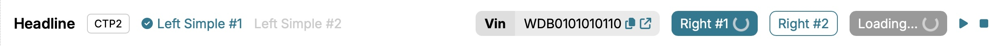

---

## Value Tile
> Useable standalone: **Yes**  
> Supports loading indicator: **Yes**  
> Supports tooltip: **Yes**  
> Selector: `ui-value-tile`  

Displays a key/value pair with optional color state, badges, and buttons. Designed for use in toolbars and dashboards.

### Inputs

#### `key`
> Type: *string*  
> Required: **Yes**  
The key (or label) shown on the left.

#### `value`
> Type: *string*  
> Required: **Yes**  
The value/content shown on the right.

#### `style`
> Type: *ValueTileStyle*  
> Optional: **Yes** (default: `None`)  
Defines the color style of the tile.  
Possible values:  
- `None` = grey (default)  
- `Attention` = orange  
- `Error` = red  
- `Success` = green  

### Accepts as Sub-Component
- [Badge](#badge) (max 1)
- [Button](#button) (max 2)

#### Useable inside
- [Toolbar](#toolbar)

### Usage

```html
<ui-value-tile key="Vin" value="WDB0101010110">
  <ui-button [icon]="faCopy()" label="Copy"></ui-button>
  <ui-button [icon]="faExternalLink()" [style]="0"></ui-button>
</ui-value
```

### Screenshot
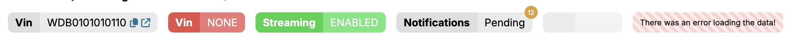

## List
> Useable standalone: **Yes**  
> Supports loading indicator: **No**  
> Supports error message: **No**  
> Supports tooltip: **No**  
> Selector: `ui-list`

A versatile list component for displaying a collection of items. Supports search filtering, alphabetical and KPI-based sorting, item selection, indexing, and an optional footer with aggregated KPI data. Items are composed declaratively via `ui-list-item` sub-components.

### Inputs

#### `header`
> Type: *string*  
> Required: **Yes**  
The header title displayed at the top of the list.

#### `description`
> Type: *string*  
> Optional: **Yes** (default: `''`)  
A description line shown below the header.

#### `isSortable`
> Type: *boolean*  
> Optional: **Yes** (default: `false`)  
If `true`, sort-by-name and sort-by-KPI buttons appear in the header. Each cycles through ascending → descending → unsorted.

#### `isSearchable`
> Type: *boolean*  
> Optional: **Yes** (default: `false`)  
If `true`, a search input is shown in the header. Items are filtered by their `text` value.

#### `showIndex`
> Type: *'number' | 'bullet' | 'dash' | 'none'*  
> Optional: **Yes** (default: `'none'`)  
Controls the index style shown before each item.

#### `showItemSeparator`
> Type: *boolean*  
> Optional: **Yes** (default: `false`)  
If `true`, a border line is drawn between items.

#### `showItemCount`
> Type: *boolean*  
> Optional: **Yes** (default: `true`)  
If `true` and no footer is present, the item count is shown in the header.

#### `preserveSelectedItem`
> Type: *boolean*  
> Optional: **Yes** (default: `true`)  
If `true`, clicking an item selects it and deselects the previous selection. If `false`, clicking does not persist the selection visually.

### Outputs

#### `onItemClick`
> Type: *OutputEmitterRef&lt;{ id: string; text: string; data: any }&gt;*  
Emits when an item is clicked. Payload contains the item's `id`, `text`, and an array of its KPI data.

#### `onDeselect`
> Type: *OutputEmitterRef&lt;void&gt;*  
Emits when all items are deselected via the "Deselect" button.

#### `onSearchTermChange`
> Type: *OutputEmitterRef&lt;string[]&gt;*  
Emits the list of visible item IDs whenever the search filter changes.

### Public Methods

#### `calculateSummaryKpiResults(type, calc)`
> Parameters: `type: 'positive' | 'negative' | 'neutral'`, `calc: 'sum' | 'avg'`  
> Returns: `ListItemKpiEntry | null`  
Calculates an aggregate KPI (sum or average) across all visible items matching the given style type. Useful for populating a footer KPI via `@ViewChild`.

### Accepts as Sub-Component
- [List Item](#list--list-item)
- [List Footer](#list--list-footer)

### Usage

```html
<ui-list
  header="Services"
  description="Overview of all active services."
  [showIndex]="'number'"
  [isSearchable]="true"
  [isSortable]="true"
  [showItemSeparator]="true"
  (onItemClick)="handleItemClick($event)"
  (onDeselect)="handleDeselect()"
>
  <ui-list-item text="Service Alpha" [isClickable]="true">
    <ui-list-item-kpi
      [value]="2500"
      [refValue]="2000"
      [showDelta]="true"
      [showPercentage]="true"
      [currency]="'EUR'"
      [style]="'positive'"
    ></ui-list-item-kpi>
  </ui-list-item>
  <ui-list-item text="Service Beta" [isClickable]="true">
    <ui-list-item-kpi
      [value]="180"
      [refValue]="200"
      [showDelta]="true"
      [style]="'negative'"
      label="p95 (ms)"
    ></ui-list-item-kpi>
  </ui-list-item>
  <ui-list-item text="Service Gamma">
    <ui-button label="Details" [icon]="faInfo()" [style]="3"></ui-button>
  </ui-list-item>
  <ui-list-footer>
    <ui-list-item-kpi
      [value]="2680"
      [refValue]="2200"
      [showDelta]="true"
      [showPercentage]="true"
      [currency]="'EUR'"
      [style]="'neutral'"
    ></ui-list-item-kpi>
  </ui-list-footer>
</ui-list>
```

---

## List :: List Item
> Useable standalone: **No** (requires `ui-list` parent)  
> Supports loading indicator: **No**  
> Supports error message: **No**  
> Supports tooltip: **Yes**  
> Selector: `ui-list-item`

A single entry inside `ui-list`. Can contain buttons, badges, and KPI indicators as projected content.

### Inputs

#### `text`
> Type: *string*  
> Optional: **Yes** (default: `''`)  
The display text of the item.

#### `icon`
> Type: *IconDefinition*  
> Optional: **Yes**  
Optional Font Awesome icon shown before the text.

#### `isClickable`
> Type: *boolean*  
> Optional: **Yes** (default: `false`)  
If `true`, the item is interactive and triggers the parent's `onItemClick` output when clicked.

### Accepts as Sub-Component
- [Button](#button)
- [Badge](#badge)
- [List Item KPI](#list--list-item-kpi)

#### Useable inside
- [List](#list)

---

## List :: List Item KPI
> Useable standalone: **No** (designed for `ui-list-item` or `ui-list-footer`)  
> Supports loading indicator: **No**  
> Supports error message: **No**  
> Supports tooltip: **No**  
> Selector: `ui-list-item-kpi`

Displays a numeric KPI value with optional label, delta, percentage change, and currency formatting. Supports color-coded styles.

### Inputs

#### `value`
> Type: *number*  
> Required: **Yes**  
The primary KPI value.

#### `label`
> Type: *string | null*  
> Optional: **Yes** (default: `null`)  
An optional label displayed next to the value (e.g., "Revenue", "p95 (ms)").

#### `refValue`
> Type: *number | null*  
> Optional: **Yes** (default: `null`)  
Reference value used to compute delta and percentage change.

#### `showDelta`
> Type: *boolean*  
> Optional: **Yes** (default: `false`)  
If `true`, shows the absolute difference between `value` and `refValue`.

#### `showPercentage`
> Type: *boolean*  
> Optional: **Yes** (default: `false`)  
If `true`, shows the percentage change relative to `refValue`.

#### `style`
> Type: *'positive' | 'negative' | 'neutral'*  
> Optional: **Yes** (default: `'neutral'`)  
Color style: `positive` (green), `negative` (red), `neutral` (grey).

#### `currency`
> Type: *'EUR' | 'USD' | 'none'*  
> Optional: **Yes** (default: `'none'`)  
If set to `'EUR'` or `'USD'`, displays the value and delta formatted as currency.

#### Useable inside
- [List Item](#list--list-item)
- [List Footer](#list--list-footer)

---

## List :: List Footer
> Useable standalone: **No** (requires `ui-list` parent)  
> Supports loading indicator: **No**  
> Supports error message: **No**  
> Supports tooltip: **No**  
> Selector: `ui-list-footer`

A sticky footer bar for the list. Displays the item count, filtered count, and current sort label automatically. Accepts `ui-list-item-kpi` as projected content for aggregate KPI display.

### Accepts as Sub-Component
- [List Item KPI](#list--list-item-kpi)

#### Useable inside
- [List](#list)

---

# Content and Navigation Components

## Grid
> Useable standalone: **Yes**  
> Supports error message: **No**  
> Supports loading indicator: **No**  
> Supports tooltip: **No**  
> Selector: `ui-grid`  

A responsive container component for arranging cards, entry tiles, and metric tiles in a multi-column grid layout.  
You can specify the number of columns (up to 6), and assign components to specific columns using the `grid-column` attribute.  
The grid automatically distributes its content into columns and adapts to the available width.

### Inputs

#### `columns`
> Type: *number*  
> Required: **Yes**  
Number of columns to display (maximum: 6).

### Accepts as Sub-Component
- [Card](#card)
- [Entry Tile](#entry-tile)
- [Metric Tile](#metric-tile)

#### Useable inside
- Any container

### Usage

```html
<ui-grid [columns]="3">
  <ui-card grid-column="1" header="Card 1"></ui-card>
  <ui-entry-tile grid-column="2"></ui-entry-tile>
  <ui-metric-tile grid-column="3"></ui-metric-tile>
</ui-grid>
```

---

## Menu Bar
> Useable standalone: **Yes**  
> Supports loading indicator: **No**  
> Supports tooltip: **No**  
> Selector: `ui-menu-bar`
#### Accepts
- Menu Item

## Menu Item (config only)
> Useable standalone: **No**  
> Supports loading indicator: **No**  
> Supports tooltip: **Yes**  
> Selector: `uic-menu-item`
#### Useable inside
- Menu Bar

---

## Side Menu
> Useable standalone: **Yes**  
> Supports loading indicator: **No**  
> Supports tooltip: **No**  
> Selector: `ui-side-menu`

### Description
A vertical navigation menu component that supports both direct menu entries and grouped sections. Uses parent injection for selection coordination — entries communicate with their parent side menu to manage selection state automatically.

### Inputs

#### `showSectionDivider`
> Type: *boolean*  
> Optional: **Yes** (default: `true`)  
Controls whether divider lines are shown between sections.

#### `showBorder`
> Type: *boolean*  
> Optional: **Yes** (default: `false`)  
If `true`, displays a border around the side menu.

#### `selectedValue`
> Type: *string | number | boolean*  
> Optional: **Yes**  
> Two-way binding supported  
The currently selected menu entry value.

### Accepts as Sub-Component
- [Side Menu Section](#side-menu--side-menu-section)
- [Side Menu Entry](#side-menu--side-menu-entry)

#### Useable inside
Any container

### Usage

```html
<ui-side-menu [(selectedValue)]="selectedMenuItem">
  <ui-side-menu-section title="Navigation">
    <ui-side-menu-entry label="Dashboard" value="dashboard" [icon]="faHome()">
    </ui-side-menu-entry>
    <ui-side-menu-entry label="Settings" value="settings" [icon]="faCog()">
    </ui-side-menu-entry>
  </ui-side-menu-section>
  
  <ui-side-menu-section title="Admin">
    <ui-side-menu-entry label="Users" value="users" [icon]="faUsers()">
      <ui-badge value="5"></ui-badge>
    </ui-side-menu-entry>
  </ui-side-menu-section>
</ui-side-menu>
```

### Screenshot
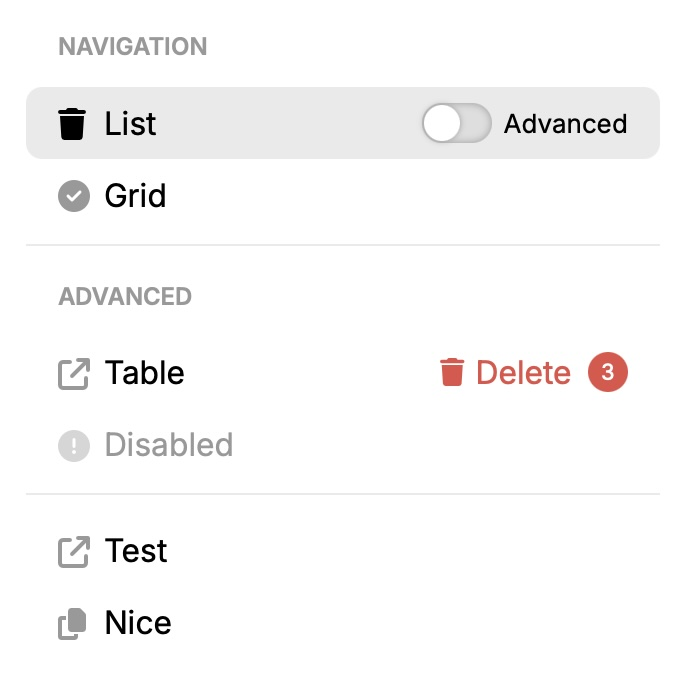

---

## Side Menu :: Side Menu Section
> Useable standalone: **No** (requires `ui-side-menu` parent)  
> Supports loading indicator: **No**  
> Supports tooltip: **No**  
> Selector: `ui-side-menu-section`

### Description
Groups related menu entries together under an optional section title. Provides visual organization within the side menu.

### Inputs

#### `label`
> Type: *string*  
> Optional: **Yes**  
Optional section label displayed above the entries.

### Accepts as Sub-Component
- [Side Menu Entry](#side-menu--side-menu-entry)

#### Useable inside
- [Side Menu](#side-menu)

### Usage
See [Side Menu](#side-menu) usage example.

---

## Side Menu :: Side Menu Entry
> Useable standalone: **Yes** (can be used with or without parent `ui-side-menu`)  
> Supports loading indicator: **No**  
> Supports tooltip: **No**  
> Selector: `ui-side-menu-entry`

### Description
Individual menu item that can be used directly in a side menu or within a section. Automatically coordinates with parent side menu for selection state, or can be used standalone with manual `isSelected` control.

### Inputs

#### `label`
> Type: *string*  
> Required: **Yes**  
Label text for the menu item.

#### `value`
> Type: *string | number | boolean*  
> Required: **Yes**  
Value associated with this menu item.

#### `icon`
> Type: *IconDefinition*  
> Optional: **Yes**  
Font Awesome icon displayed beside the label.

#### `isDisabled`
> Type: *boolean*  
> Optional: **Yes** (default: `false`)  
If `true`, the menu item is disabled and cannot be clicked.

#### `isSelected`
> Type: *boolean*  
> Optional: **Yes** (default: `false`)  
Manual override for standalone usage (without parent `ui-side-menu`). When used inside a parent side menu, selection is automatically managed.

#### `isExpanded`
> Type: *boolean*  
> Optional: **Yes** (default: `true`)  
> Two-way binding supported  
Controls whether sub-entries are expanded or collapsed. Only relevant if the entry has sub-entries.

### Outputs

#### `onSelectionChange`
> Type: *OutputEmitterRef&lt;string | number | boolean&gt;*  
Emits the entry's value when it is clicked and selected.

### Accepts as Sub-Component
- [Badge](#badge)
- [Button](#button)
- [Switch](#switch)
- [Side Menu Sub Entry](#side-menu--side-menu-sub-entry)

#### Useable inside
- [Side Menu](#side-menu)
- [Side Menu Section](#side-menu--side-menu-section)

### Usage
See [Side Menu](#side-menu) usage example.

---

## Side Menu :: Side Menu Sub Entry
> Useable standalone: **No** (requires `ui-side-menu-entry` parent)  
> Supports loading indicator: **No**  
> Supports tooltip: **No**  
> Selector: `ui-side-menu-sub-entry`

### Description
Sub-menu item that nests under a `ui-side-menu-entry` to create hierarchical navigation. Automatically coordinates with the parent side menu for selection state management. Displayed indented under its parent entry.

### Inputs

#### `label`
> Type: *string*  
> Required: **Yes**  
Label text for the sub-menu item.

#### `value`
> Type: *string | number | boolean*  
> Required: **Yes**  
Value associated with this sub-menu item.

#### `isDisabled`
> Type: *boolean*  
> Optional: **Yes** (default: `false`)  
If `true`, the sub-menu item is disabled and cannot be clicked.

#### `isSelected`
> Type: *boolean*  
> Optional: **Yes** (default: `false`)  
Manual override for standalone usage. When used inside a parent side menu, selection is automatically managed by comparing the parent's `selectedValue` with this item's `value`.

### Outputs

#### `onSelectionChange`
> Type: *OutputEmitterRef&lt;string | number | boolean&gt;*  
Emits the sub-entry's value when it is clicked and selected.

### Accepts as Sub-Component
NONE

#### Useable inside
- [Side Menu Entry](#side-menu--side-menu-entry)

### Usage

```html
<ui-side-menu [(selectedValue)]="selectedMenuItem">
  <ui-side-menu-section title="Navigation">
    <ui-side-menu-entry label="Settings" value="settings" [icon]="faCog()">
      <ui-side-menu-sub-entry label="Profile" value="settings-profile"></ui-side-menu-sub-entry>
      <ui-side-menu-sub-entry label="Security" value="settings-security"></ui-side-menu-sub-entry>
      <ui-side-menu-sub-entry label="Notifications" value="settings-notifications"></ui-side-menu-sub-entry>
    </ui-side-menu-entry>
  </ui-side-menu-section>
</ui-side-menu>
```

---

## Window

> Useable standalone: **Yes**  
> Supports loading indicator: **Yes**  
> Supports tooltip: **No**  
> Selector: `ui-window`
#### Accepts
- Content
- Menu Bar

---

## Content

> Useable standalone: **Yes**  
> Supports loading indicator: **Yes**  
> Supports tooltip: **No**  
> Selector: `ui-content`
#### Useable inside
- Window

### Inputs

#### `isLoading`
> Type: *boolean*  
> Optional: **Yes** (default: `false`)

### Methods

#### `showMessage`
> Signature: showMessage(message: BannerMessage)

Shows a banner at the top of the page based on `BannerMessage` definition.
Pre-requisite: `ContentComponent` is injected in the component which is contained in the router outlet (e.g. `content = inject(ContentComponent, {optional: true});`).  
Then it can be used like: 

```ts
content?.showMessage({ text: 'This is an error banner message.', type: 'error', showCloseButton: true, duration: 9000 });
```

### Component Usage

```html
<ui-content [isLoading]=false>
  <router-outlet></router-outlet>
</ui-content>
```

